# Wogger (Pro)


> A friendly, no-fuss work logger for Windows. Built fresh with ChatGPT-5-Codex + GitHub Copilot.
> **Pro** = **Pro**duction, **Pro**fessional, **Pro**ductivity (and a little **Pro**-crastination prevention).

Have you ever reached that once-a-year productivity review and realized you forgot to track… half the things you did?
**Wogger (Pro)** is a lightweight, always-there companion that nudges you to log what you’re doing, keeps your time segments tidy, and gives you a clean dashboard when you need the numbers.

**Happy wogging! 🎉**

---

## Download

Grab the latest Windows executable **[here](https://github.com/da1081/wogger-pro/releases)**.

Run it, and you’re off.

> **Heads-up:** the EXE is currently **unsigned**. Windows SmartScreen may ask if you trust the file. Choose **More info → Run anyway** if you obtained it from the official link and you trust the source.

---

## Table of Contents

* [Highlights](#highlights)
* [Screenshots](#screenshots)
* [How it Works](#how-it-works)
* [Features](#features)

  * [Scheduled Prompts](#scheduled-prompts)
  * [Prompt Dialog](#prompt-dialog)
  * [Manual Segment Entry](#manual-segment-entry)
  * [Per-Task Dashboard](#per-task-dashboard)
  * [Task Management](#task-management)
  * [Backups](#backups)
  * [Settings Panel](#settings-panel)
  * [CSV Import & Merge](#csv-import--merge)
* [Installation (Development)](#installation-development)
* [Running the App](#running-the-app)
* [Project Layout](#project-layout)
* [Specs & Tech](#specs--tech)
* [Data & Privacy](#data--privacy)
* [Troubleshooting](#troubleshooting)
* [Roadmap](#roadmap)
* [Contributing](#contributing)
* [License](#license)

---

## Highlights

* ✅ **Cron-based scheduled prompts** that politely pop up and say “what are you working on?”
* 🧠 **Manual segment entry** with conflict detection—backfill without breaking your timeline
* 📊 **Per-task dashboard** with Today/All/custom range filters & sortable summaries
* 🏷️ **Rename tasks in bulk** right from the dashboard
* 💾 **ZIP backups** (manual & recurring) with retention caps and detailed logs
* 🌓 **Theme switching** (light/dark) with theme-aware icons
* 🔊 **Optional sounds** for prompts (nice, not noisy)
* 🗃️ **Durable NDJSON storage**—simple, local, reliable
* 📥 **CSV import** with merge strategies (append, de-dup, replace overlaps)
* 🧩 **Built in Python + Qt 6 (PySide6)** for a responsive native UI

---

## Screenshots

### Primary Prompt

| Light                                      | Dark                                     |
| ------------------------------------------ | ---------------------------------------- |
| 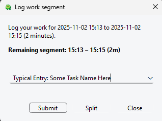 | 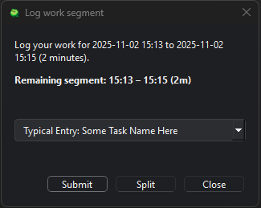 |

### Split Mode

| Light                                      | Dark                                     |
| ------------------------------------------ | ---------------------------------------- |
| 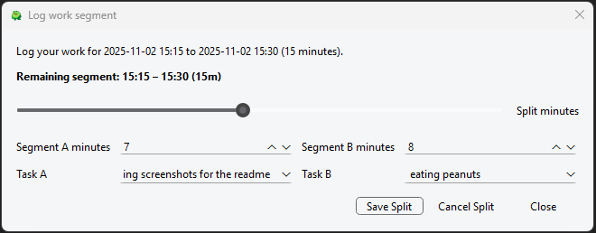 | 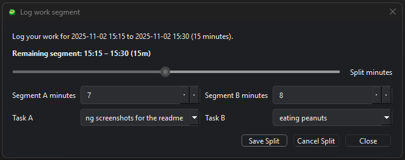 |

### Manual Segment Entry

| Light                                                  | Dark                                                 |
| ------------------------------------------------------ | ---------------------------------------------------- |
| 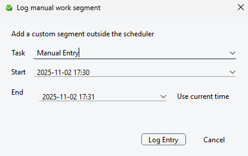 | 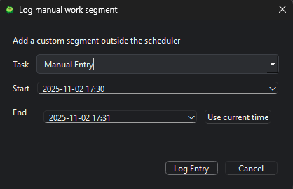 |

### Dashboard

| Light                                            | Dark                                           |
| ------------------------------------------------ | ---------------------------------------------- |
|  | 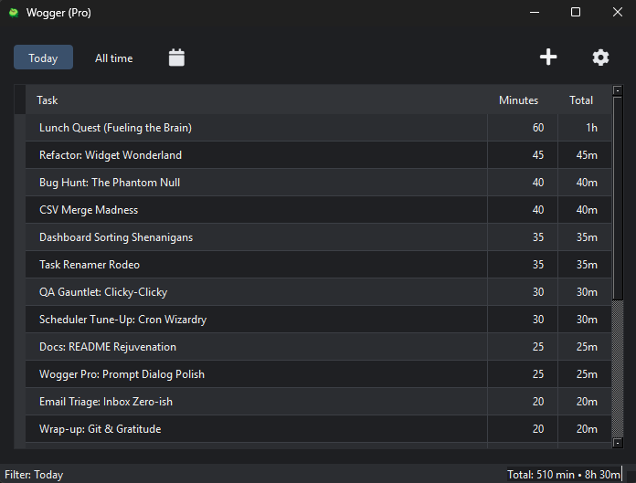 |

### Settings

| Light                                          | Dark                                         |
| ---------------------------------------------- | -------------------------------------------- |
| 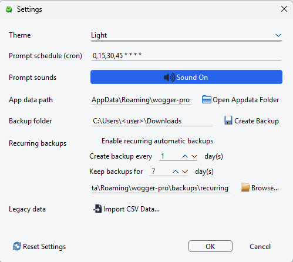 | 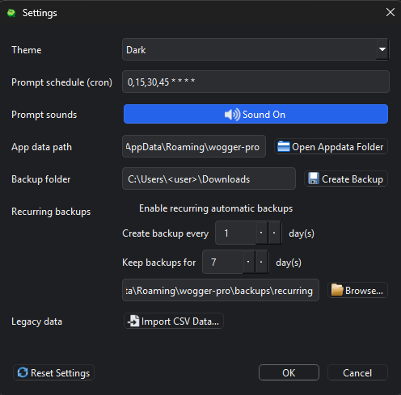 |

### Import

| Light                                        | Dark                                       |
| -------------------------------------------- | ------------------------------------------ |
| 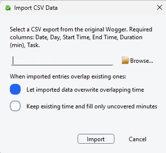 | 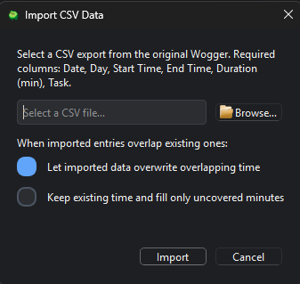 |

---

## How it Works

* **You set a schedule** (via cron) for when Wogger (Pro) should nudge you.
* **A tiny prompt appears** (always on top) so you can quickly confirm, split, or adjust what you’re doing.
* **Entries are stored locally** as NDJSON lines in your app-data folder.
* **The dashboard** rolls everything up by task with fast filters for Today/All/custom ranges.
* **Backups** (manual or recurring) keep your log safe as ZIP archives with retention limits.

> First launch creates `%APPDATA%\wogger-pro`. Settings, entries, and rolling logs live there.
> You can relocate the app-data folder from **Settings** (e.g., point it at OneDrive/Dropbox).

---

## Features

### Scheduled Prompts

* **Cron-based automatic reminders** using a familiar format (`*/15 * * * *` etc.)
* **Respects manual segments**—prompts won’t bulldoze what you’ve entered
* **Split remainders**—long gaps can be divided sensibly (e.g., last task vs. new task)
* **Cascading pop-ups**—new prompts offset so they don’t sit exactly on top of each other
* **Optional audio cues**—short, friendly pings via QtMultimedia

### Prompt Dialog

* **Always-on-top logger** so you never lose it behind windows
* Default **Continue / Submit** flow for fast entry
* **Split mode** to divide time across multiple tasks
* **Adjustable remainder handling** (decide how to allocate unlogged time)
* **Theme-aware icons** and compact, keyboard-friendly controls

### Manual Segment Entry

* Open via the **toolbar button** to backfill work
* **Conflict detection**: warns about overlapping segments
* **Auto-updating end time** when you tweak the start
* Clear **validation** messages so your timeline stays clean

### Per-Task Dashboard

* **Filterable totals**: Today / All / custom range
* **Live refresh** as you log
* **Sortable summaries** with right-aligned **aggregate minutes** and **pretty totals**
* Export via CSV (from the dashboard or app-data)

### Task Management

* **Double-click to rename** any task across the entire log
* **Suggestions** refresh on demand and stay **sorted by usage**
* Quick task picking from your recent common tasks

### Backups

* **Manual ZIP export** to any folder
* **Recurring automatic backups** (daily/weekly/etc.) with retention caps (e.g., keep last N backups)
* **Detailed logging** for backup runs
* Restore is simply extracting the ZIP into your app-data folder (or pointing the app to the restored location)

### Settings Panel

* **Theme toggle** (light/dark)
* **Cron editor** with syntax helpers
* **Relocate app-data** safely (e.g., move to a synced drive)
* **Open folder shortcut** to `%APPDATA%\wogger-pro`
* **Backup configuration** (frequency, destination, retention)
* **Sound toggle** for prompt pings
* **CSV import workflow** with merge strategies
* **Reset to defaults** (non-destructive: prompts you before changes)

### CSV Import & Merge

Bring in CSV time data from other tools or past exports.
Pick a **merge strategy** that fits your situation:

* **Append**: Add everything as new rows
* **Skip Duplicates**: Add only rows that don’t already exist (by time/task)
* **Replace Overlaps**: For imported rows that overlap existing segments, replace the existing ones within the overlap window

The import screen previews totals and shows any validation issues before you commit.

---

## Installation (Development)

> Requires **Python 3.11+** on Windows.

```powershell
# From the project root
python -m venv .venv
.\.venv\Scripts\Activate.ps1
pip install --upgrade pip
pip install -e .
```

## Running the App

```powershell
# Inside the virtual environment
wogger-pro
```

On first run, Wogger (Pro) creates `%APPDATA%\wogger-pro` and starts with sensible defaults.

---

## Building the EXE

Want a standalone executable? Use PyInstaller from your virtual environment:

```powershell
# From the project root, inside .venv
pip install --upgrade pip
pip install pyinstaller

pyinstaller --noconfirm --clean --windowed --onefile --name wogger-pro `
>>   --icon resources/wogger.ico `
>>   --add-data "resources/*;resources" `
>>   --collect-all qtawesome `
>>   --hidden-import PySide6.QtMultimedia `
>>   --hidden-import PySide6.QtMultimediaWidgets `
>>   src/wogger_pro/__main__.py
```

Key notes:

* The command bundles all Qt assets, audio support, and the `resources/` folder so prompt icons and sounds work out of the box.
* The finished executable lands in `dist/wogger-pro.exe`; intermediate build assets go to `build/`.
* Delete `build/` and `dist/` between runs if you want a clean rebuild.

You can tweak the PyInstaller flags (for example, add `--uac-admin` or change the icon), but the above invocation matches the GitHub Actions release build.

---

## Project Layout

* `src/wogger_pro/app.py` – application entry point
* `src/wogger_pro/core/` – persistence, models, scheduler, configuration
* `src/wogger_pro/ui/` – Qt widgets, dialogs, icons, and UI glue
* `images/` – screenshots and artwork used by this README

---

## Specs & Tech

**What it is:** Windows desktop work logger with scheduled prompts, dashboard filters, durable NDJSON storage, manual/split logging, CSV import/merge, theme switching, recurring/manual backups, and sound cues.

**Primary tech:**

* Python **3.11+**
* **PySide6** (Qt 6)
* Cron-based scheduling (`croniter`)
* **QtAwesome** icons
* **QtMultimedia** for audio pings

**Dependencies (pyproject):**

* `PySide6 >= 6.7`
* `QtAwesome >= 1.3`
* `croniter >= 2.0`
* `portalocker >= 2.8`

Built as a ground-up rewrite of the original **wogger** (da1081/wogger), now powered by **ChatGPT-5-Codex** + **GitHub Copilot** to modernize the codebase and UI.

---

## Data & Privacy

* Your data stays **local** by default under `%APPDATA%\wogger-pro`.
* Entries are stored as **NDJSON** (one segment per line) for durability and easy export.
* You control backups: either manual ZIPs or scheduled archives with retention.
* You can **relocate** the app-data folder (Settings) to keep it under your own sync/backup strategy.

---

## Troubleshooting

* **SmartScreen warning** on first run? Use **More info → Run anyway** if you trust the source.
* **No prompts appearing?** Check your **cron schedule** in Settings and ensure Wogger (Pro) is running.
* **Sound not playing?** Toggle **Sounds** in Settings and verify your system volume/output device.

---

## Roadmap

* Categorize tasks, custom categories with color accents
* Timeline view of segments

*(If you have ideas—open an issue!)*

---

## Contributing

1. Fork & clone
2. Create a virtual environment and `pip install -e .`
3. Run `wogger-pro` and make your change
4. Submit a pull request with a short before/after note and screenshots if UI-related

Please keep code tidy and UI consistent with the current theme/style.

---

## License

TBD. See `LICENSE` when it lands in the repository.


